# From Development to Production — a Lifecycle Guide

This document has two parts:

1. **Generic** — the universal path of taking *any* software product from development to a published,
   maintained release, with diagrams. Domain-agnostic; reuse it for any project.
2. **Loupe-specific** — how those generic steps map onto this repository (a Godot 4.7 desktop app with a
   standalone Python content-generator).

---

# Part 1 — The generic lifecycle

## 1.1 The big picture

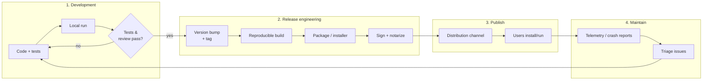

The loop is the point: **maintenance feeds back into development.** A product is never "done"; it is
*released* and then *operated*.

## 1.2 Stage gates — what "ready to ship" means

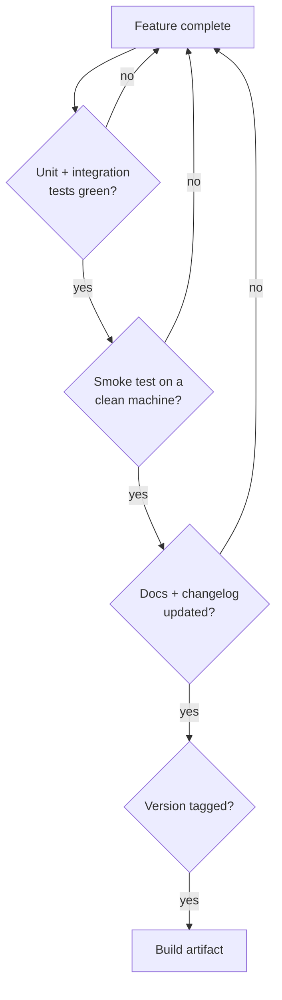

Each diamond is a **gate**: never skip one to ship faster — skipped gates become user-visible bugs.

## 1.3 Versioning & branching

Use **Semantic Versioning** `MAJOR.MINOR.PATCH`:

- **MAJOR** — breaking changes (users must adapt).
- **MINOR** — new features, backward-compatible.
- **PATCH** — bug fixes only.

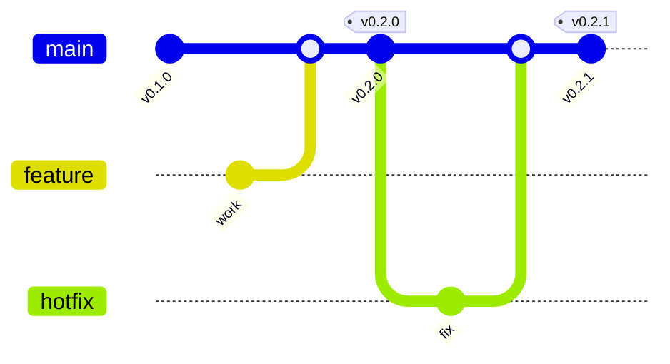

`main` stays releasable; develop on branches; tag releases off `main`; keep a human `CHANGELOG.md`.

## 1.4 The build & release pipeline (CI/CD)

Automate so releasing is *boring and repeatable* — a human should never hand-assemble an artifact.

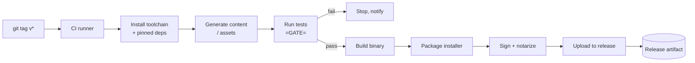

Trigger on a **tag** (not every commit) so releases are deliberate. The tests step is a hard gate.

## 1.5 Packaging & signing (what makes it feel "real")

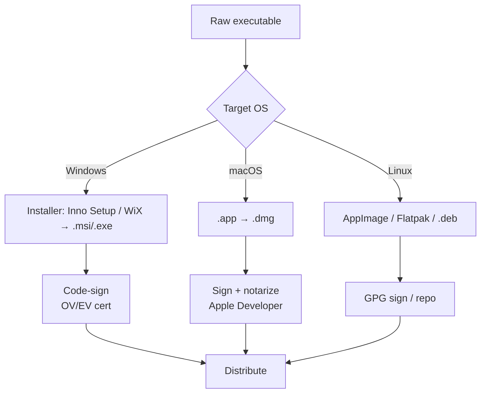

- **Installer** gives shortcuts, an uninstaller, file associations — not just a loose binary.
- **Signing** removes "Unknown publisher" / Gatekeeper blocks. This is the **first real cost**
  (Windows cert ~$200–400/yr; Apple Developer $99/yr). A $0 product ships unsigned with a documented
  "Run anyway" note — acceptable for personal/portfolio tools, not for wide public distribution.

## 1.6 Distribution channels

| Channel | Cost | Best for |
|---|---|---|
| GitHub Releases | $0 | Versioned downloads, open or personal tools |
| itch.io | $0 | Indie / visual apps; free auto-updating launcher |
| Microsoft Store | ~$19 once | Windows discovery + trust |
| Mac App Store | $99/yr | macOS reach (strict sandbox + review) |
| Steam | $100/app | Games / interactive tools with an audience |
| Self-host + website | hosting cost | Full control, your own brand |

## 1.7 The maintenance loop (after launch)

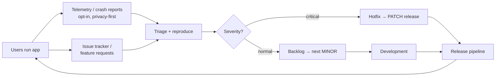

- **Crash/error reporting** (e.g. Sentry free tier, or local logs the user attaches) tells you it's
  broken *before* users complain.
- **Updates**: manual re-download to start; add auto-update (check a releases API, prompt) only when you
  have real users.
- **Support surface**: README, a docs page, issue templates, and — for a visual app — a demo GIF/video.

## 1.8 The cross-cutting concerns (don't forget)

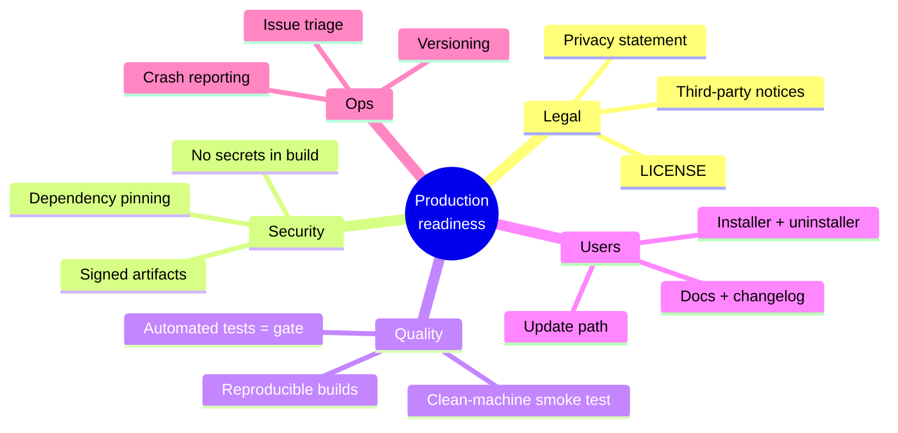

---

# Part 2 — Loupe-specific steps

Loupe has **two halves**, and keeping them separate is the key architectural rule:

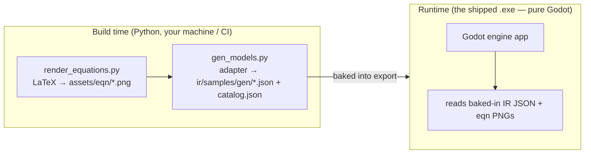

> **The trap to avoid:** never bundle the Python adapter into the runtime. The adapter is a *build-time*
> content generator; the shipped app is a self-contained Godot binary that only reads pre-generated IR.
> This keeps the desktop app dependency-free, fast, and simple for users.

## 2.1 One-time setup (per machine / CI runner)

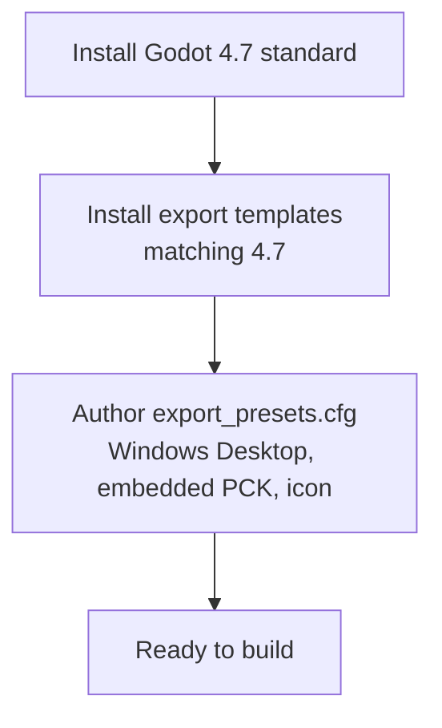

- **Export templates** (~1 GB, version-pinned): `Godot --headless --install-export-templates`, or via the
  editor's *Manage Export Templates*. Only re-downloaded when you **upgrade Godot** (e.g. 4.7 → 4.8).
- **Export preset**: a `export_presets.cfg` with a `Windows Desktop` preset (embedded `.pck`, `icon.svg`).

## 2.2 The build flow (every release)

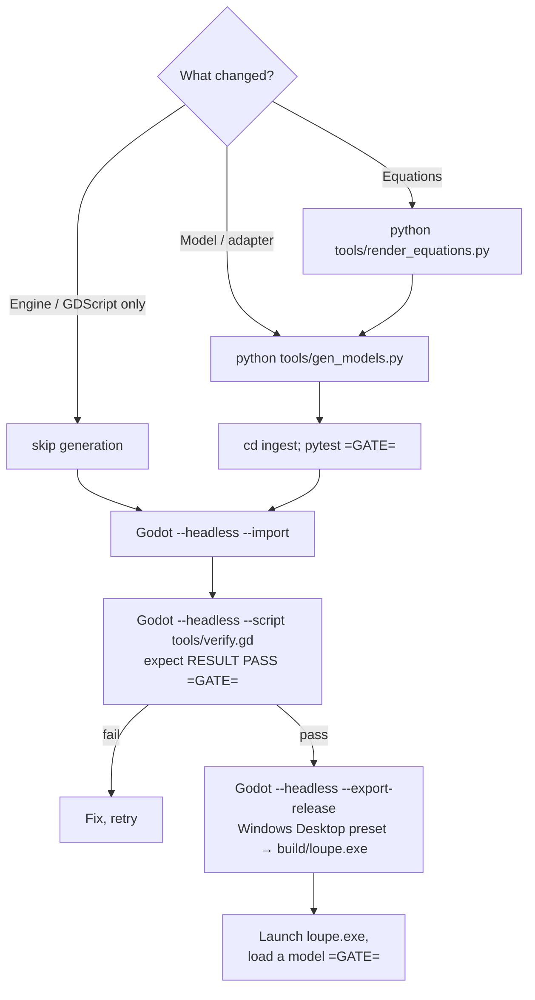

Because the `.exe` reads **baked-in** JSON/PNGs, any new model or equation must be regenerated **before**
export — otherwise it won't appear in the build.

### One-command build (recommended)

A `tools/build.ps1` that chains the flow so a release is a single command:

```powershell
# tools/build.ps1  (illustrative)
python tools/render_equations.py
python tools/gen_models.py
Push-Location ingest; python -m pytest -q; if ($LASTEXITCODE) { throw "tests failed" }; Pop-Location
$GODOT = (Get-ChildItem "$env:LOCALAPPDATA\Microsoft\WinGet\Packages\GodotEngine.GodotEngine_*\Godot_v4.7-stable_win64.exe").FullName
& $GODOT --headless --path . --import
& $GODOT --headless --path . --script res://tools/verify.gd   # exits non-zero on FAIL
if ($LASTEXITCODE) { throw "verify failed" }
New-Item -ItemType Directory -Force build | Out-Null
& $GODOT --headless --path . --export-release "Windows Desktop" build/loupe.exe
```

Then any update = edit → `./tools/build.ps1` → ship `build/loupe.exe`.

## 2.3 Update decision tree (which gates apply)

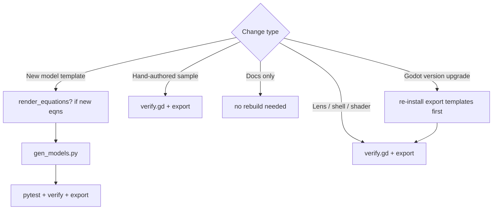

## 2.4 Publishing Loupe (recommended $0 path, in order)

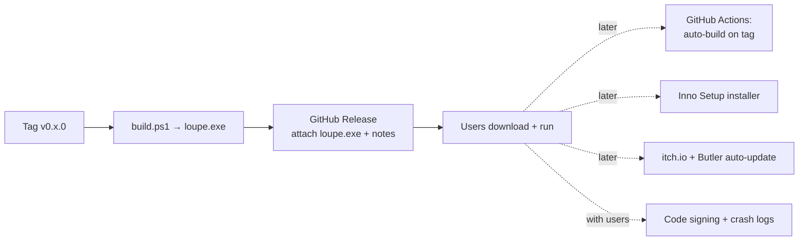

1. **Now:** `README.md`, `build.ps1`, export preset, **GitHub Releases** with an unsigned `loupe.exe` and a
   "More info → Run anyway" note. ($0, shippable today.)
2. **Soon:** GitHub Actions to run `build.ps1` on every `v*` tag and attach the artifact; an Inno Setup
   installer; a demo GIF; a docs page (GitHub Pages).
3. **When you have users:** Windows code signing (EV first), auto-update against the Releases API, opt-in
   local crash logs.
4. **If you want reach:** itch.io, then the Microsoft Store.

## 2.5 Loupe release checklist

- [ ] `decisions.md` updated for any architectural change (ADR LP-NNN).
- [ ] `handoff.md` reflects current state.
- [ ] `python tools/render_equations.py` (if equations changed).
- [ ] `python tools/gen_models.py` (if any model/template changed) → `catalog.json` regenerated.
- [ ] `cd ingest && python -m pytest -q` → all pass.
- [ ] `Godot --headless --script res://tools/verify.gd` → **RESULT PASS**.
- [ ] Version bumped in `project.godot`; `CHANGELOG.md` entry added; git tag `vX.Y.Z`.
- [ ] `build.ps1` produces `build/loupe.exe`; launched on a clean window and a model loads.
- [ ] GitHub Release created; `loupe.exe` attached; "how to run unsigned" note included.

---

*Generic lifecycle is reusable for any product; Part 2 is the concrete mapping for Loupe. Keep build-time
generation and runtime strictly separated — that single rule keeps the shipped app simple.*
